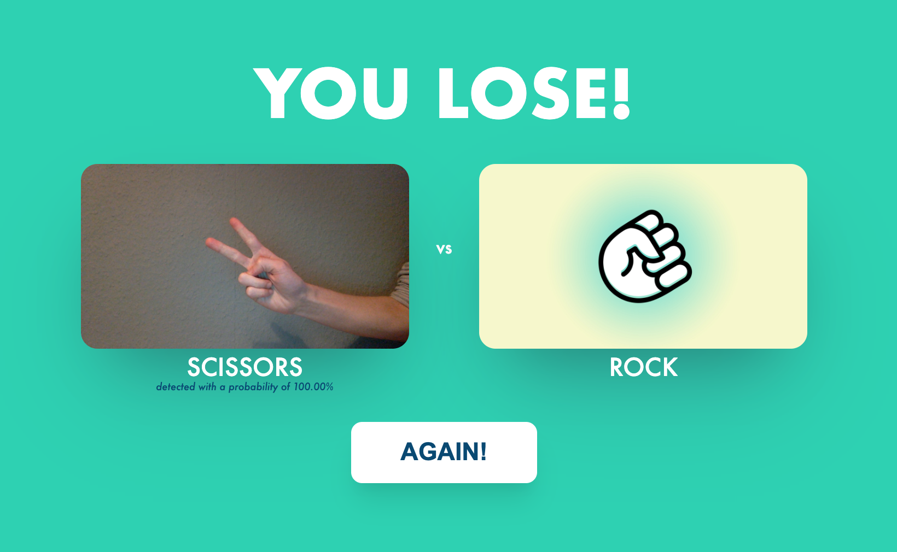

# Play Rock, Paper, Scissors with the help of machine learning!

Image classification project as part of my experiential semester.  

The goal of the project is to build a machine learning model, that detects whether a player's hand shows 'rock', 'paper' or 'scissors' to enable him to play a game against the computer. 

  

The project is dividid into different parts:  

* *data_gen.py:* Python app to generate training- & testing data with a webcam (results in data-directory)
* *data_prep.ipynb:* Analysing and prepping data for the modelling
* *modelling.ipynb:* Finding the best hyperparameters and training the final model
* *evaluation.ipynb:* Evaluating the models' performance and to make the black-box understandable
* *deployment:* Deployment of the web-based game 'Rock, Paper, Scissors' in which the final model is embedded